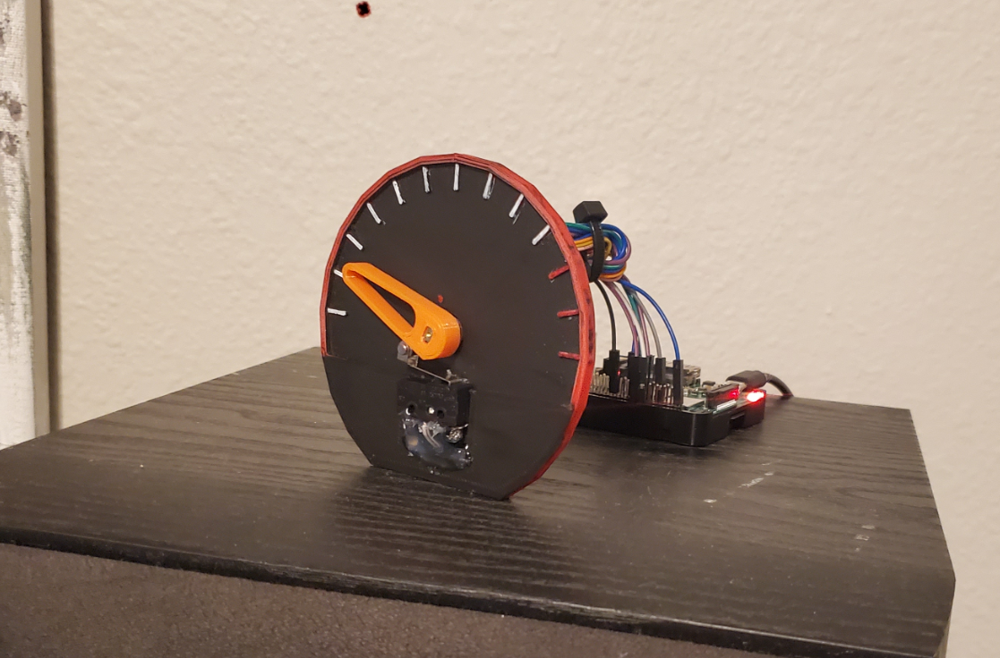

# InternetSpeedometer
An internet speed gauge for your desk!

**Basic concept came from this post:**

https://medium.com/@Keithweaver_/controlling-stepper-motors-using-python-with-a-raspberry-pi-b3fbd482f886

**I used the "pyspeedtest" CLI package, which needed to be updated per this post:**

https://stackoverflow.com/questions/50999879/pyspeedtest-cannot-find-test-server
